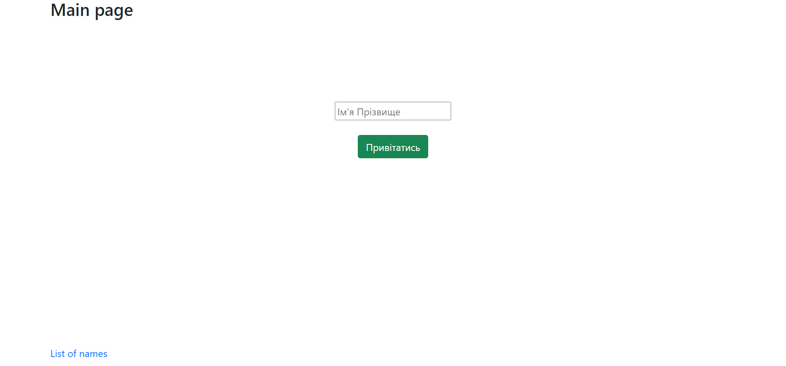
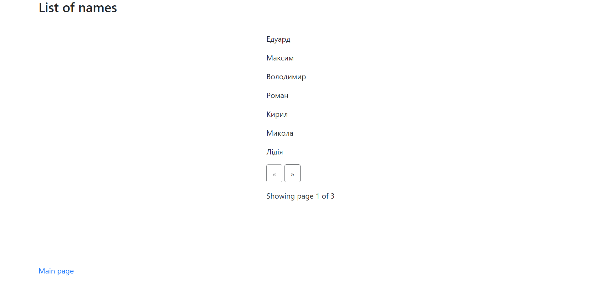

# Тестове завдання
###### Реалізував Грищенко Едуард

Даний веб-сервіс було реалізовано на ***Flask***.
Базою даних було вибрано ***sqlite3*** та для роботи з базою даних було вибрано ORM  ***flask_sqlalchemy***.

Головним файлом є *app.py*.

В папці templates знаходяться 3 шаблона ***Jinja***:
+ *base.html* - базовий шаблон.
+ *main_page.html* - шаблон головної сторінки.
+ *list_of_names.html* - шаблон сторінки зі списком всіх збережених імен.

В папці db знаходиться файл бази даних *hi.db*.

Зовнішній вид головної сторінки:


---

Зовнішній вид сторінки зі списком:


---

На сторінці зі списком було додатково реалізовано пагінацію.

Після було створено файл *requirements.txt* з залежностями за допомогою даної команди:

```
>>> python -m pip freeze > requirements.txt
```

Після було створено файл *Dockerfile* та створено Docker контейнер:

```
>>> docker image build -t web-evo .
```

Далі було запущено даний контейнер. Тепер за посиланням Localhost:5000 відкривався створений веб-сервіс.

```
>>> docker run -p 5000:5000 -d web-evo
acba7ce39d46c9731a9c9555a526a2dab7e28716776e10adac445d9197744e10
```

Потім було прописано файл *Procfile* та завантажено веб-сервіс на хост Heroku. Переглягути його можливо за посиланням:

https://web-evo.herokuapp.com/
